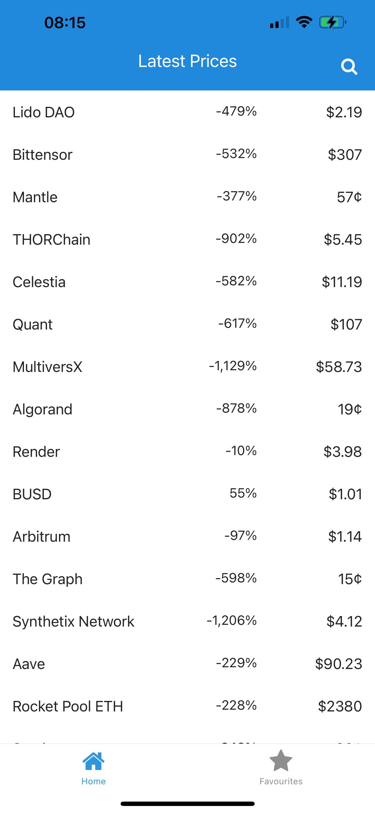
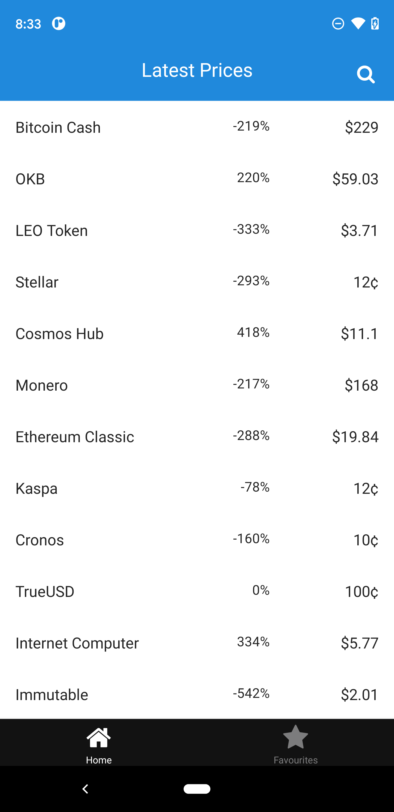
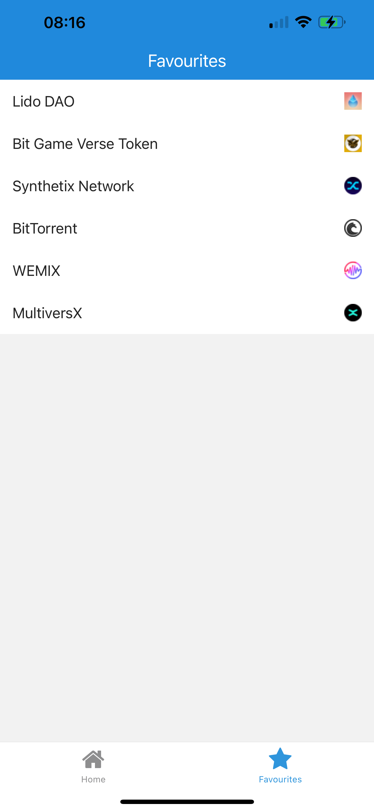
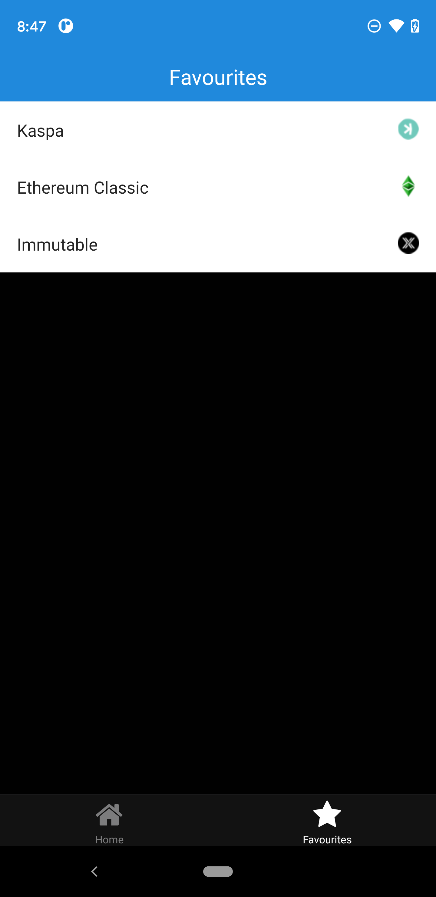
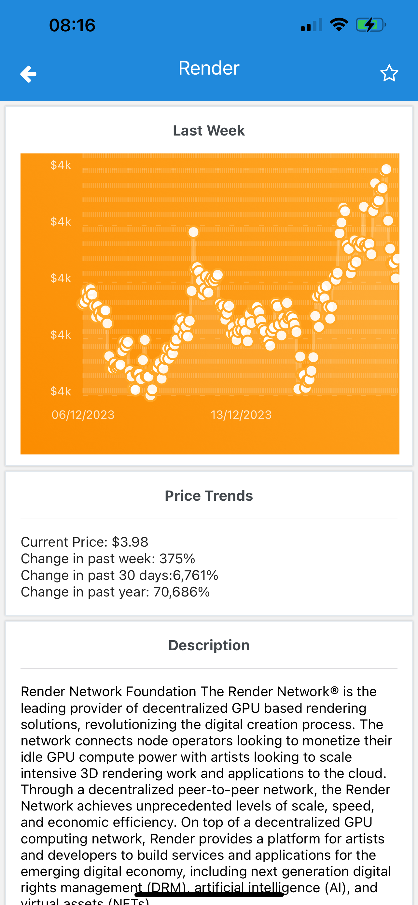
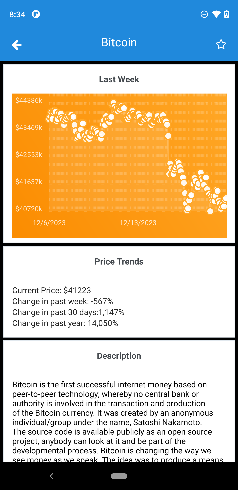
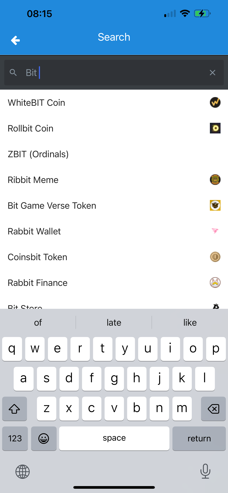
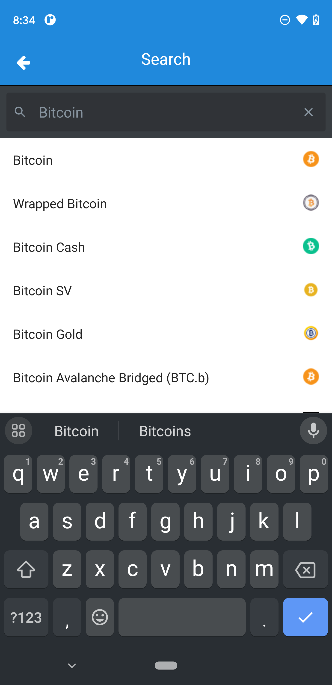

# Coin App

WARNING: It is very easy to rate limit yourself for the CoinGecko API. It's recommended hopping around with a VPN connection.

This app was created using the Tabs starter from Expo-router (`npx create-expo-app@latest --template tabs@49`).

## Navigation and Screens

Expo-router handles navigation for the app. The screens outlined in the requirements have the following routes.

### Home:

Path: `/`

### Favourites

Path: `/favourites`

### Information
Path: `/coin/{id}`, where `id` is a coin id from the Coin-Gecko Api.

### Search

Path: `/search`

## Unit/E2E Javascript Testing

Tests can either be run:

1. `yarn test` - on a unit basis -- TBC
2. `yarn e2e` - on an end to end basis (basic tests for the CoinGecko API)

## Maestro Integration Tests

First start a (reccomended) release variant/configuration build on android/ios

For android, `yarn android --variant Release`
For ios, `yarn ios --configuration Release`

Next, to run Maestro:

2. Test using `yarn maestro:{PLATFORM}`
3. Record using `yarn maestro:record:${PLATFORM}`

Note that the flow files are different on each platform owing to unusual behaviour of tabs in ios. Tip, use `maestro studio` to inspect when writing tests.

## Development

The app can be run on simulator or a connected device using:

1. `yarn ios`
2. `yarn android`

It isn't recommended to use Expo Go.

Reactotron is enabled in DEV only.

## Building for Devices

The app is built locally using Expo (this could be moved to expo CI/CD). Build will not work without access to a working Expo account and/or signing credentials, you can set these up following the docs here `https://docs.expo.dev/build/introduction/.` 

Note that if using a different Expo account, the configuration in `app.json` will need updating.

On iOS, the build targets `internal` distribution, so devices must be enrolled to the account using `eas device:create` or manually using UDID.

A production release without developer tools is built.

1. `yarn build:android`. This outputs to `outputs/prod.apk`. You can run this on a connected usb device using `yarn android:device`
2. `yarn build:ios`. This outputs to `outputs/prod.ipa`.
3. `yarn build:cloud`. This builds in the cloud using eas instead.

Sentry is enabled in dev only

## App Icon and Splash screen

App icons and spash screen were generated using a Bitcoin icon sourced online and the Expo tutorial here `https://docs.expo.dev/develop/user-interface/app-icons/`.
A local copy of the figma template file is saved in `figma-app-icon.fig`. The exported assets are here `/Users/ben/edfcrypto/outputs/figma-app-icons`, and have also been copied to the `assets/images` directory to replace the template starters.

## Todo
1. Improve error handling esp on Information screen. Ensure loading occurs within cards.
3. Add Infinite scroll to market list
5. Make tab bar RNEU
6. Add Maestro tests
7. Add i18n?
10. Review Rehydration of api data.
11. Add screenshot taking on Maestro
